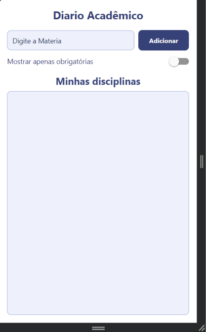
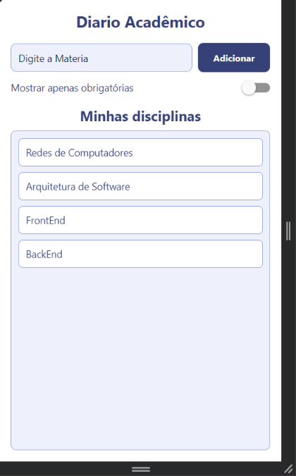

# **Atividade 01 - MeuDiarioAcademico**

## Tela Inicial sem registros

## Tela com registros na lista

---

## Como foi Criado

1. Rode git checkout -b feature/atividade01
2. cd praticas/pratica04
3. npx create-expo-app@latest MeuDiarioAcademico --template blank
4. cd MeuDiarioAcademico
5. npx expo install react-native-web @expo/metro-runtime react-native-safe-area-context
6. npx expo start --web