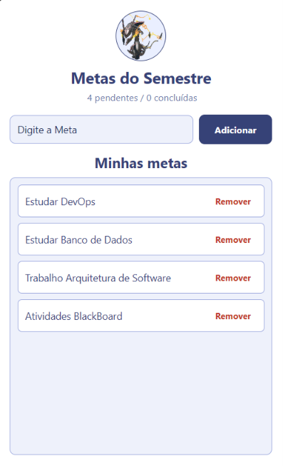
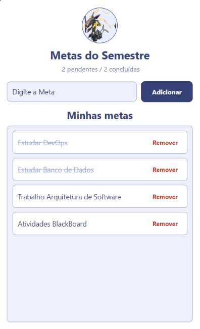

MetasSemestre
=============

Como rodar
----------

npx expo install @react-native-async-storage/async-storage react-native-safe-area-context
npx expo start

Estrutura
---------

- App.js: estado principal (inputMetaText, metas), handlers de adicionar, remover e alternar concluída, e os dois useEffect de persistência.
- components/MetaInput.js: TextInput + Pressable de adicionar, recebe value, onChangeText e onAdd por props.
- components/MetaList.js: FlatList das metas, recebe metas, onDelete e onToggle por props.
- labels.js: textos usados na tela e nas mensagens de erro.

Onde está o useEffect de carga
-------------------------------

No App.js, o primeiro useEffect roda uma vez ao montar o componente (array de dependências vazio). Ele busca a chave '@metas_semestre' no AsyncStorage e, se existir algo salvo, faz JSON.parse e popula o estado metas.

Onde está o useEffect de salvamento
-------------------------------------

O segundo useEffect tem [metas, carregando] como dependências, então roda toda vez que a lista de metas muda. Ele ignora a primeira execução (enquanto carregando ainda é true) para não sobrescrever o storage com uma lista vazia antes da carga terminar, e depois disso salva a lista atual com JSON.stringify.

Prints
------

## Lista Vazia

## Lista com Registros

## Lista com Registros Concluídos
