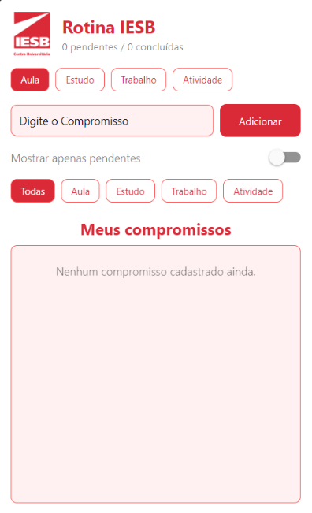
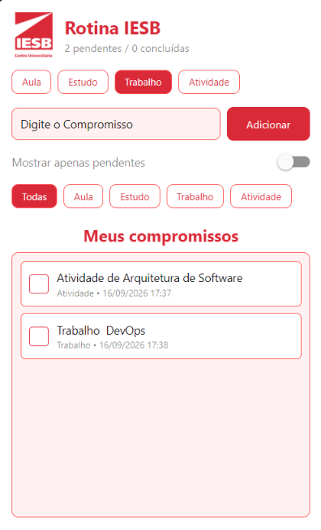
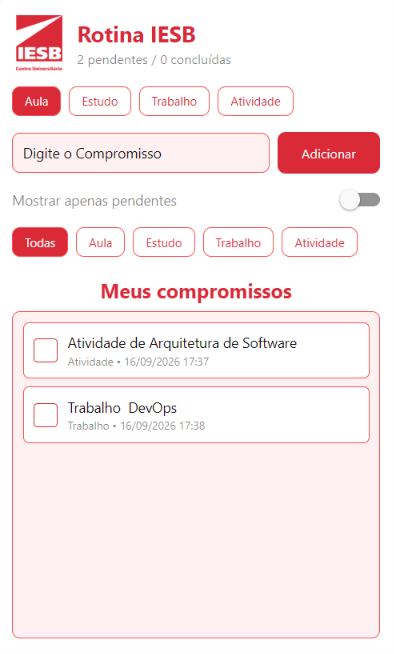

# RotinaIESB

Organizador simples da rotina acadêmica do aluno do IESB. O app permite cadastrar
compromissos (aula, estudo, trabalho, lazer), marcar como concluídos, filtrar por
categoria ou por pendentes, e mantém os dados salvos mesmo após fechar o app.

Projeto desenvolvido em React Native com Expo, como Atividade Integradora das
Aulas 02 a 06 da disciplina Programação para Dispositivos Móveis.

## 1. Comando usado para criar o projeto

```bash
npx create-expo-app@latest RotinaIESB --template blank
```

## 2. Instalação de dependências

```bash
cd RotinaIESB
npx expo install @react-native-async-storage/async-storage react-native-safe-area-context
```

## 3. Como executar

```bash
npx expo start
```

Em seguida, abra no aplicativo Expo Go ou Web caso esteja no computador.

## 4. Estrutura de arquivos

```
RotinaIESB/
  App.js
  labels.js
  assets/
    iesb-icone.png
  components/
    CompromissoInput.js
    CompromissoList.js
  package.json
  app.json
  README.md
```

**Arquivos criados em `components/` e `labels.js`:**

- `labels.js` — rótulos de texto usados no app (título, placeholders, mensagens
  de erro, categorias, etc.), todos exportados como constantes nomeadas.
- `components/CompromissoInput.js` — campo de texto, seletor de categoria e
  botão de adicionar compromisso.
- `components/CompromissoList.js` — lista de compromissos (FlatList), com
  checkbox de concluído e exclusão ao tocar no item.

## 5. Onde estão os useEffect de carga e salvamento

Ambos ficam em `App.js`, dentro do componente `App`:

- **Carga (montagem do app):** primeiro `useEffect`, com array de dependências
  vazio (`[]`). Lê o AsyncStorage pela chave `@rotina_iesb_compromissos`, faz
  `JSON.parse` dos dados e popula o state `compromissos`. Em caso de erro,
  exibe um alerta amigável (`MensagemErroCarregar`).

- **Salvamento (sempre que a lista muda):** segundo `useEffect`, com
  dependências `[compromissos, carregando]`. Ignora a primeira renderização
  (enquanto `carregando` é `true`, para não sobrescrever os dados recém
  carregados) e, a cada mudança na lista, salva com `JSON.stringify` no
  AsyncStorage. Em caso de erro, exibe `MensagemErroSalvar`.

## 6. Funcionalidades principais

- Cabeçalho com imagem e título, junto ao contador de "X pendentes / Y
  concluídas".
- Cadastro de compromissos com validação de campo vazio (Alert).
- Cada compromisso possui `id` único (`Date.now().toString()`), `texto`,
  `criadaEm` (data/hora de criação) e `concluida` (boolean).
- Marcar/desmarcar como concluído pelo checkbox à esquerda do item (texto
  riscado quando concluído).
- Excluir compromisso tocando no próprio item da lista.
- Filtro "Mostrar apenas pendentes" (Switch).
- Lista renderizada com `FlatList` e `ListEmptyComponent` para quando não há
  compromissos cadastrados.

## 7. Prints

**Lista vazia**



**Lista com Compromissos**



**Lista após reabrir** (dados persistidos)

